# Trabajando con Servicios en Service Fabric – Parte I

## Introducción

Tiempo estimado para completar este laboratorio: 60-90 minutos

Luego de completar este laboratorio serás capaz de:

* Poner en funcionamiento y gestionar clusters de Service Fabric en tu máquina de desarrollo
* Comprender los conceptos de Service Fabric de aplicaciones, servicios, servicios stateless (sin estado), gestión de ciclo de aplicaciones, diagnóstico y salud
* Usar Visual Studio y Service Fabric Explorer para desarrollar aplicaciones con Service Fabric eficientemente

## Prerequisitos

Antes de poder trabajar con este laboratorio, deberás tener: 

- [Visual Studio 2015](https://www.visualstudio.com/en-us/products/vs-2015-product-editions.aspx) con Update 3 (14.0.25420.1)
- [Service Fabric SDK](http://www.microsoft.com/web/handlers/webpi.ashx?command=getinstallerredirect&appid=MicrosoftAzure-ServiceFabric) v2.3.301.9590. 

Si estás usando una versión diferente de Visual Studio o del Service Fabric SDK puede haber diferencias entre lo que está documentado en este laboratorio y lo que veas en la pantalla. Lee [Cómo preparar el ambiente de desarrollo](https://docs.microsoft.com/es-es/azure/service-fabric/service-fabric-get-started) para obtener información sobre cómo instalar un ambiente de desarrollo en tu máquina.

## Pantallazo del laboratorio

El objetivo de este laboratorio es familiarizarte con un flujo de desarrollo de punta a punta para aplicaciones de Service Fabric. Practicarás la creación de una aplicación de Service Fabric en tu máquina de desarrollo, trabajando con servicios stateless, desplegando, actualizando, y monitoreando una aplicación desplegada. A lo largo del ejercicio te irás acostumbrando a las herramientas de Service Fabric en Visual Studio, a Service Fabric Explorer y aprenderás cómo usar ambos de manera efectiva.


## Escenario

En este escenario construirás un servicio genérico de votación usando los servicios confiables de Service Fabric. El servicio escucha en un endpoint accesible desde un navegador web. Ingresarás los textos de los items (como tus jugadores o autos favoritos) usando una Single Page Application (SPA). Cada vez que el mismo item sea votado un contador se incrementará; esto representa el número de veces que fue votado. Cada respuesta HTML contiene todos los items que pueden votarse y la cantidad de veces que cada uno ha sido votado.

## Crear un servicio stateless

1. Abre **Visual Studio** con **permisos de administrador**, para esto, abre el menú de inicio (o presiona la tecla de Windows ), escribe "Visual Studio" y ejecútalo haciendo **clic con el botón derecho** y eligiendo **Correr como administrador**. 

    > **Nota**: Visual Studio debe ser abierto con permisos de administrador porque necesita interactuar con el entorno de ejecución de Service Fabric.

1. Selecciona **File** | **New** | **Project...**.

1. Dentro de los templates instalados, seleccionar **Cloud** dentro de **Visual C#** y elige **Service Fabric application**.

   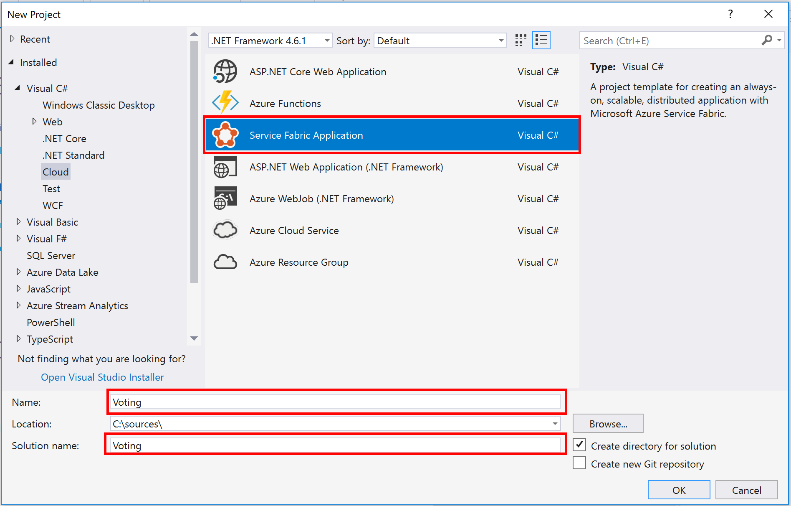

4. Ingresa "**Voting**" como el _Name_ y _Solution Name_ y presiona **OK**.

1. En los templates de servicios elige **Stateless Web API** e ingresa "_VotingService_" como el nombre del servicio. Haz clic en **OK**.

   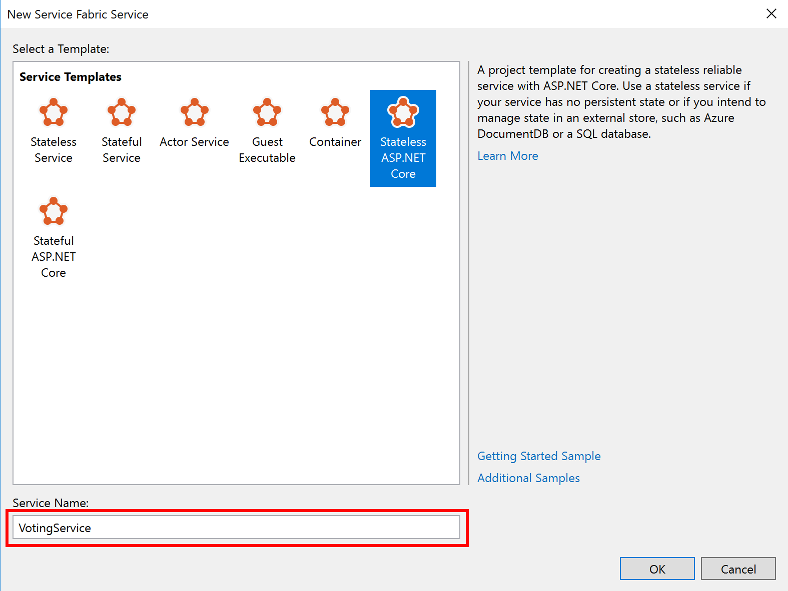

1. Visual Studio creará una solución conteniendo dos proyectos, _Voting_ y _VotingService_. 

    El proyecto _Voting_ es un proyecto de Service Fabric que contiene:

   - Una referencia al proyecto *VotingService*
   - Una carpeta *ApplicationPackageRoot* que contiene el archivo *ApplicationManifest.xml* que describe nuestra aplicación Service Fabric
   - Una carpeta *ApplicationParameters* que contiene los parámetros de despliegue para despliegues locales (*Local.1Node.xml* y *Local.5Node.xml*) y en la nube (*Cloud.xml*). En este laboratorio sólo usaremos los parámetros de *Local.5Node.xml*
   - Una carpeta *PublishProfiles* conteniendo los perfiles de despliegue para hacer despliegue local (*Local.1Node.xml* y *Local.5Node.xml*) y en la nube (*Cloud.xml*). En este laboratorio sólo usaremos el perfil *Local.5Node.xml*. El perfil *Cloud* se usa para publicar en Azure
   - Una carpeta *Scripts* que contiene los scripts usados para desplegar la aplicación en el cluster
   - Un archivo *Packages.config* que contiene los paquetes asociados a la aplicación

   El proyecto *VotingService* contiene:

   - Una carpeta *Controllers* conteniendo los controllers para este proyecto. Se ha generado un controller inicial llamado *ValuesController.cs*
   - Una carpeta *PackageRoot* conteniendo la configuración del servicio y el archivo *ServiceManifest.xml*
   - El archivo *OwinCommunicationsListener.cs* contiene la implementación de ICommunicationListener basada en el framework HTTP Owin
   - El archivo *Program.cs* que es el host ejecutable del servicio stateless
   - El archivo *ServiceEventSource.cs* contiene la clase usada para eventos de diagnóstico
   - El archivo *Startup.cs* contiene la configuración de inicio (startup) del servidor de la aplicación
   - El archivo *VotingService.cs* contiene la implementación de clases del servicio stateless de votación

1. En este punto ya tenemos un servicio funcional que puede ser hosteado en **Service Fabric**. Presiona **F5** para ver el servicio corriendo. Dentro de **Visual Studio**, el panel **Diagnostic Events** se hará visible y mostrará los mensajes que vienen de la aplicación.

   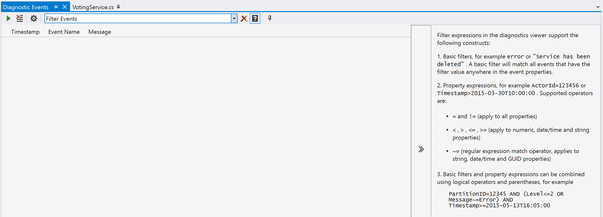

   > **Nota**: En la versión 5.3 del SDK se generan muchos eventos de Service Fabric y ocultan los eventos que son parte de este laboratorio. Para deshabilitar los eventos extra, haz clic en el icono del engranaje en la ventana de **Diagnostic Events** y remueve la línea de "_Microsoft-ServiceFabric:5:0x4000000000000000_". Luego haz clic en **Apply**.

1. La aplicación desplegada también puede verse en **Service Fabric Explorer**. Para esto, haz clic derecho en el ícono de Service Fabric  en el área de notificaciones y elije **Manage Local Cluster**. Se abrirá el **Service Fabric Explorer (SFX)** en tu navegador.

   > **Nota**: si el ícono no está presente, inicia el Service Fabric Local Cluster Manager (Administrador de cluster local de Service Fabric) yendo al menú de inicio y escribiendo "Service Fabric Local Cluster Manager". Ejecuta la aplicación presionando **Enter**. Esto ejecutará el **Service Fabric Local Cluster Manager** y aparecerá el ícono de Service Fabric  en el área de notificaciones. Si todavía no has creado un cluster, selecciona **Start Local Cluster** y elije 5 nodos.

1. En el lado izquierdo de SFX expande por completo el árbol de aplicaciones. Verás que la aplicación *fabric:/Voting* ha sido desplegada, y contiene un solo servicio llamado *fabric:/Voting/VotingService*. El servicio tiene una sola instancia que está desplegada en un nodo (_Node_0 en este caso).

1. Selecciona **Instance (_Node_X)**, donde X es el número mostrado. Del lado derecho del SFX verás más detalles del servicio, incluyendo el endpoint en el cual reside en este momento (http://localhost:8454 en este ejemplo, tu puerto probablemente sea diferente). Copia esta dirección y agrega *"api/values"* en la barra de direcciones de tu navegador. Esto devolverá un documento JSON que contiene ["value1", "value2"], que es el valor de retorno estándar del template que usamos.

    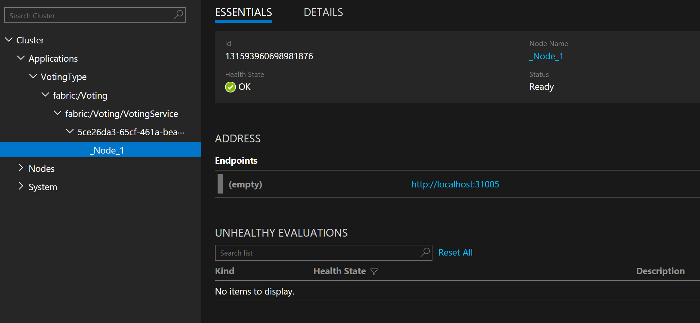

1. Detén la aplicación saliendo del debugger. Esto removerá la aplicación de Service Fabric.


Has completado las partes relacionadas a tener las réplicas del servicio escuchando solicitudes HTTP del cliente. En la próxima sección añadirás código para procesar las solicitudes para mantener de los items votados y sus cantidades.

# Agregar los endpoints para votación

El próximo paso es agregar ciertos endpoints que pueden ser usados para votar y ver los votos. Hemos creado una Single Page Application con ese propósito.

1. Haz clic derecho en el proyecto **Voting** y selecciona **Properties**. Remueve el valor de la propiedad **Application URL** y haz clic en **OK**. Esto previene que se abra el navegador cada vez que hagamos debug. 

    > **Nota**: Como referencia, la propiedad **Application Debug Mode** está establecida para remover automáticamente la aplicación de Service Fabric cuando detenemos el debugging.

    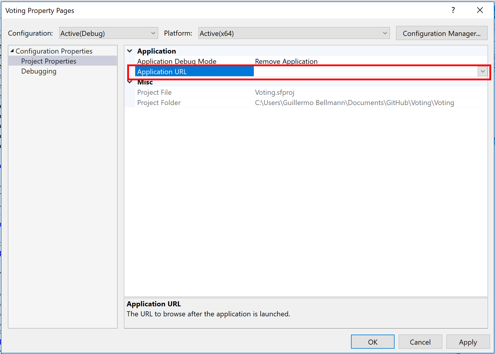

1. En el proyecto **VotingService**, abrir el archivo *ServiceManifest.xml* que se encuentra en la carpeta *PackageRoot*. Remover *Port="XXXX"* del elemento *Endpoint*, donde XXXX es el número de puerto asignado. En este ejemplo el número de puerto es el 8454. Esto permite a _Service Fabric_ asignar un puerto aleatorio para tu servicio.

    **Cambiar**

    ```xml
    <Endpoint Protocol="http" Name="ServiceEndpoint" Type="Input" Port="8454" />
    ```

    **Por**           

    ```xml
    <Endpoint Protocol="http" Name="ServiceEndpoint" Type="Input" />
    ```

    > *Nota*: Estamos permitiendo que _Service Fabric_ asigne los puertos porque más adelante en el laboratorio correremos múltiples instancias del servicio en nuestr máquina de desarrollo. Sin este cambio, sólo la primera instancia arrancaría exitosamente. Incluso en producción, es mejor usar puertos asignados dinámicamente para evitar conflictos de puertos con otros servicios que pudieran estar corriendo en los nodos, excepto por los nodos expuestos al balanceador de carga de Azure.

1. Renombrar **ValuesController.cs** a **VotesController.cs**. Si nos pregunta si queremos renombrar la clase, respondemos que **si**. Asegúrate que la clase *ValuesController* haya sido cambiada a *VotesController*.

1. Agrega una nueva clase al proyecto *VotingService* llamada *"HtmlMediaFormatter.cs"* y pega el contenido siguiente **dentro de las llaves de la declaración del namespace**. Remueve las directivas using redundantes en la parte superior de archivo de ser necesario.

    ```csharp
    using System;
    using System.IO;
    using System.Text;
    using System.Net.Http;
    using System.Net.Http.Headers;
    using System.Net.Http.Formatting;

    // This class is needed to be able to return static files from the WebAPI 2 self-host infrastructure.
    // It will return the index.html contents to the browser.
    public class HtmlMediaFormatter : BufferedMediaTypeFormatter
    {
        public HtmlMediaFormatter()
        {
            SupportedMediaTypes.Add(new MediaTypeHeaderValue("text/html"));
            SupportedEncodings.Add(new UTF8Encoding(encoderShouldEmitUTF8Identifier: false));
        }

        public override bool CanReadType(Type type)
        {
            return false;
        }

        public override bool CanWriteType(Type type)
        {
            return (typeof(string) == type) ? true : false;
        }

        public override void WriteToStream(Type type, object value, Stream writeStream, HttpContent content)
        {
            Encoding effectiveEncoding = SelectCharacterEncoding(content.Headers);

            using (var writer = new StreamWriter(writeStream, effectiveEncoding))
            {
                writer.Write(value);
            }
        }
    }
    ```

1. Abrir *Startup.cs* y reemplazar el contenido del método *ConfigureApp* con el siguiente código.

    ```csharp
    // Configure Web API for self-host. 
    HttpConfiguration config = new HttpConfiguration();

    config.MapHttpAttributeRoutes();                  // NUEVO
    config.Formatters.Add(new HtmlMediaFormatter());  // NUEVO

    config.Routes.MapHttpRoute(
        name: "DefaultApi",
        routeTemplate: "api/{controller}/{id}",
        defaults: new { id = RouteParameter.Optional }
    );

    appBuilder.UseWebApi(config);
    ```

1. Agrega un nuevo archivo HTML al proyecto *VotingService* llamado *"index.html"*. Este es el archivo de la _Single Page Application (SPA)_ de _Angular_ que muestra la experiencia de usuario y se comunica con la API REST del servicio. Explicar más acerca de Angular excede el ámbito de este laboratorio. Pega el contenido siguiente.

    ```html
    <!DOCTYPE html>
    <html lang="en" xmlns="http://www.w3.org/1999/xhtml" ng-app="VotingApp" xmlns:ng="http://angularjs.org">
    <head>
        <meta charset="utf-8" />
        <meta content="IE=edge, chrome=1" http-equiv="X-UA-Compatible" />
        <meta name="viewport" content="width=device-width, initial-scale=1, maximum-scale=1" />

        <!-- Stylesheets -->
        <link href="http://maxcdn.bootstrapcdn.com/bootstrap/3.3.4/css/bootstrap.min.css" rel="stylesheet">

        <!-- Application title and icons -->
        <title>Voting Service Lab Sample</title>

        <!-- IE Fix for HTML5 Tags -->
        <!--[if lt IE 9]>
        <script src="http://html5shiv.googlecode.com/svn/trunk/html5.js"></script>
        <![endif]-->

    </head>
    <body ng-controller="VotingAppController">
        <div class="container-fluid">
            <h1>Votes</h1>
            <div>
                Add new voting item <input id="txtAdd" type="text" class="form-control" placeholder="Enter new voting term" ng-model="item" />
                <button id="btnAdd" class="btn btn-primary" ng-click="add(item)">Add</button>
            </div>
            <br />
            <table class="table table-striped table-condensed table-hover">
                <thead>
                    <tr>
                        <td>Voting Item</td>
                        <td>Count</td>
                        <td><button id="btnRefresh" class="btn btn-primary" ng-click="refresh()">Refresh</button></td>
                    </tr>
                </thead>
                <tr ng-repeat="vote in votes">
                    <td><button class="btn btn-primary" ng-click="add(vote.Key)">{{vote.Key}}</button></td>
                    <td>{{vote.Value}}</td>
                    <td><button class="btn btn-default" ng-click="remove(vote.Key)">Remove</button></td>
                </tr>
            </table>
        </div>

        <!-- 3rd party libraries -->
        <script src="http://ajax.googleapis.com/ajax/libs/angularjs/1.3.0/angular.js"></script>
        <script src="http://ajax.googleapis.com/ajax/libs/angularjs/1.3.0/angular-route.js"></script>
        <script src="http://ajax.googleapis.com/ajax/libs/angularjs/1.3.0/angular-cookies.js"></script>
        <script src="http://ajax.googleapis.com/ajax/libs/angularjs/1.3.0/angular-animate.min.js"></script>
        <script src="http://ajax.googleapis.com/ajax/libs/angularjs/1.3.0/angular-sanitize.min.js"></script>
        <script src="http://ajax.googleapis.com/ajax/libs/jquery/1.11.1/jquery.min.js"></script>
        <script src="http://maxcdn.bootstrapcdn.com/bootstrap/3.3.4/js/bootstrap.min.js"></script>
        <script src="https://cdnjs.cloudflare.com/ajax/libs/angular-ui-bootstrap/0.12.1/ui-bootstrap-tpls.js"></script>

        <!-- Load application main script -->
        <script>
            var app = angular.module('VotingApp', ['ui.bootstrap']);
            app.run(function () { });

            app.controller('VotingAppController', ['$rootScope', '$scope', '$http', '$timeout', function ($rootScope, $scope, $http, $timeout) {

                $scope.refresh = function() {
                    $http.get('../api/votes')
                        .success(function (data, status) {
                            $scope.votes = data;
                        })
                        .error(function (data, status) {
                            $scope.votes = undefined;
                        });
                };

                $scope.remove = function (item) {
                    $http.delete('../api/' + item)
                        .success(function (data, status) {
                            $scope.refresh();
                        })
                };

                $scope.add = function (item) {
                    var fd = new FormData();
                    fd.append('item', item);
                    $http.post('../api/' + item, fd, {
                        transformRequest: angular.identity,
                        headers: { 'Content-Type' : undefined }
                    })
                    .success(function(data, status)
                    {
                        $scope.refresh();
                        $scope.item = undefined;
                    })
                };
            }]);
        </script>
    </body>
    </html>
    ```

1. Haz clic derecho sobre el archivo **index.html** y selecciona **Properties** **(Alt+Enter)**. En la ventana de propiedades cambia la propiedad **Copy to Output Directory** a **Copy Always**.

1. Abre *VotesController.cs* y pega la siguiente implementación **dentro de las llaves del namespace**. Remueve las directivas using redundantes en la parte superior de archivo de ser necesario. Ten en cuenta que el path se encuentra fijo y depende de la versión. Cuando la versión se modifique más adelante en este laboratorio, el archivo no estará más en esta ubicación.

    ```csharp
    using System;
    using System.Collections.Generic;
    using System.IO;
    using System.Net;
    using System.Net.Http;
    using System.Threading;
    using System.Net.Http.Headers;
    using System.Web.Http;

    public class VotesController : ApiController
    {
        // Used for health checks.
        public static long _requestCount = 0L;

        // Holds the votes and counts. NOTE: THIS IS NOT THREAD SAFE FOR THE PURPOSES OF THE LAB ONLY.
        static Dictionary<string, int> _counts = new Dictionary<string, int>();

        // GET api/votes 
        [HttpGet]
        [Route("api/votes")]
        public HttpResponseMessage Get()
        {
            Interlocked.Increment(ref _requestCount);

            List<KeyValuePair<string, int>> votes = new List<KeyValuePair<string, int>>(_counts.Count);
            foreach(KeyValuePair<string, int> kvp in _counts)
            {
                votes.Add(kvp);
            }

            var response = Request.CreateResponse(HttpStatusCode.OK, votes);
                response.Headers.CacheControl = new CacheControlHeaderValue() { NoCache = true, MustRevalidate = true };
                return response;
        }

        [HttpPost]
        [Route("api/{key}")]
        public HttpResponseMessage Post(string key)
        {
            Interlocked.Increment(ref _requestCount);

            if (false == _counts.ContainsKey(key))
            {
                _counts.Add(key, 1);
            }
            else
            {
                _counts[key] = _counts[key] + 1;
            }

            return Request.CreateResponse(HttpStatusCode.NoContent);
        }

        [HttpDelete]
        [Route("api/{key}")]
        public HttpResponseMessage Delete(string key)
        {
            Interlocked.Increment(ref _requestCount);

            if (true == _counts.ContainsKey(key))
            {
                if (_counts.Remove(key))
                    return Request.CreateResponse(HttpStatusCode.OK);
            }

            return Request.CreateResponse(HttpStatusCode.NotFound);
        }

        [HttpGet]
        [Route("api/{file}")]
        public HttpResponseMessage GetFile(string file)
        {
            string response = null;
            string responseType = "text/html";

            Interlocked.Increment(ref _requestCount);

            // Validate file name.
            if ("index.html" == file)
            {
                // This hardcoded path is only for the lab. Later in the lab when the version is changed, this
                // hardcoded path must be changed to use the UX. In part 2 of the lab, this will be calculated
                // using the connected service path.
                string path = string.Format(@"..\VotingServicePkg.Code.1.0.0\{0}", file);
                response = File.ReadAllText(path);
            }

            if (null != response)
                return Request.CreateResponse(HttpStatusCode.OK, response, responseType);
            else
                return Request.CreateErrorResponse(HttpStatusCode.NotFound, "File");
        }
    }
    ```

1. Presiona **F5** para entrar en modo debug. Después que la aplicación haya sido desplegada localmente, hay dos formas de determinar el endpoint al que debemos navegar:

    1. En la ventana de **Diagnostic Events** que debería estar abierta en Visual Studio, habrá un evento llamado "ServiceMessage" en cuyo cuerpo se encuentra la URL base en la cual está escuchando el servicio, ej. "Listening on http://localhost:34001". Si la ventana Diagnostic Events no está abierta, se puede abrir en Visual Studio yendo a **View** luego **Other windows** y luego **Diagnostic Events**.

    1. Abre **Service Fabric Explorer** (SFX), navega a la instancia y ve la propiedad **Endpoints** como se describió anteriormente.

    > **Nota**: En la versión 5.3 del SDK se generan muchos eventos de Service Fabric y ocultan los eventos que son parte de este laboratorio. Para deshabilitar los eventos extra, haz clic en el icono del engranaje en la ventana de Diagnostic Events y remueve la línea de "_Microsoft-ServiceFabric:5:0x4000000000000000_".

1. Cuando hayas determinado la URI base correcta, navega a *\<URI base\>/api/index.html*. Esto mostrará la SPA que acabamos de crear, excepto que no tendrá datos. Pruébala. Si quieres asegurarte que está llamando al servicio, puedes poner breakpoints en la clase *ValuesController*.

    

1. Cuando hayas terminado de usar la aplicación, termina la sesión de debugging seleccionando **Debug** y luego **Stop debugging** (Mayus+F5). Esto desinstalará la aplicación de Service Fabric, y si estamos viendo el **Service Fabric Explorer** (SFX) veremos que no está más desplegada.


## Instrumentando el código

Cualquier código de servicio debe ser instrumentado para permitirnos monitorear el servicio y hacer debugging forense de la aplicación. No es probable que vayamos a adjuntar el debugger a una instancia que esté corriendo en producción.

1. Abre el archivo *ServiceEventSource.cs*. Este archivo contiene los eventos estructurados que pueden verse en la ventana Diagnostic Events y pueden ser capturados por Azure diagnostics.

1. Expande la region de Keywords, verás la clase estática Keywords. Estos keywords son los que luego puedes filtrar en la ventana Diagnostic Events u otro visualizador basado en ETW. Agrega una nueva definición de keyword.

    ```csharp
    public const EventKeywords HealthReport = (EventKeywords)0x4L;
    ```

1. Expande la region de Events y agrega tres nuevas definiciones de eventos estructurados al final de la region. Cada evento debe tener un identificador y un nombre únicos. Estamos definiendo eventos estructurados en vez de un único evento que acepte una cadena de caracteres para facilitar la búsqueda y filtrado de los eventos luego que sean logueados. Hay un huevo intencional en el número para permitir la adición de eventos ServiceRequestXXXX si se necesita más adelante.

    ```csharp
    private const int HealthReportEventId = 100;
    [Event(HealthReportEventId, Level = EventLevel.LogAlways, Message = "Health report. Source '{0}' property {1} is {2}. Partition: {3}, Instance or Replica: {4} Desc: {5}.", Keywords = Keywords.HealthReport)]
    public void HealthReport(string healthSourceId, string name, string state, Guid partition, long instanceOrReplica, string description )
    {
        WriteEvent(HealthReportEventId, healthSourceId, name, state, partition, instanceOrReplica, description);
    }

    private const int HealthReportIntervalChangedEventId = 101;
    [Event(HealthReportIntervalChangedEventId, Level = EventLevel.Informational, Message = "Health report interval changed to {4} seconds for {0} property {1}. Partition: {2} Instance or Replica: {3}.", Keywords = Keywords.HealthReport)]
    public void HealthReportIntervalChanged(string healthSourceId, string name, Guid partition, long instanceOrReplica, int duration)
    {
        WriteEvent(HealthReportIntervalChangedEventId, healthSourceId, name, partition, instanceOrReplica, duration);
    }
    ```

1. Agrega un argumento *activityId* a los métodos de los eventos *ServiceRequestStart* y *ServiceRequestStop*. El *activityId* es un identificador único usado para seguir el hilo de ejecución a través tu código. También hará posible combinar los eventos de inicio y fin. Los métodos quedarán como

    ```csharp
    private const int ServiceRequestStartEventId = 5;
    [Event(ServiceRequestStartEventId, Level = EventLevel.Informational, Message = "Service request '{0}' started.                                           Activity id: {1}", Keywords = Keywords.Requests)]
    public void ServiceRequestStart(string requestTypeName, string activityId = "")
    {
        WriteEvent(ServiceRequestStartEventId, requestTypeName, activityId);
    }

    private const int ServiceRequestStopEventId = 6;
    [Event(ServiceRequestStopEventId, Level = EventLevel.Informational, Message = "Service request '{0}' finished          Activity id: {1}", Keywords = Keywords.Requests)]
    public void ServiceRequestStop(string requestTypeName, string activityId = "", string exception = "")
    {
        WriteEvent(ServiceRequestStopEventId, requestTypeName, activityId, exception);
    }
    ```

26. Abre el archivo *ValuesController.cs*. Al principio de cada método agrega el siguiente código, reemplazando XXX con el nombre del método. De ser necesario, agrega `using System;` a la sección de usings.

    ```csharp
    string activityId = Guid.NewGuid().ToString();
    ServiceEventSource.Current.ServiceRequestStart("VotesController.XXX", activityId);
    ```

    y al final del método, antes de la cláusula `return` agrega lo siguiente y asegúrate de usar la misma cadena de caracteres para el parámetro *requestTypeName*.

    ```csharp
    ServiceEventSource.Current.ServiceRequestStop("VotesController.XXX", activityId);
    ```

27. Abre *VotingService.cs*. Asegúrate que estén incluidos estas directivas:

    ```csharp
    using System;
    using System.Fabric.Health; 
    ```

    agrega lo siguiente al constructor o crea el constructor si no existe

    ```csharp
    public VotingService(StatelessServiceContext context)
        : base(context)
    {
        // Create the timer here, so we can do a change operation on it later, avoiding creating/disposing of the 
        // timer.
        _healthTimer = new Timer(ReportHealthAndLoad, null, Timeout.Infinite, Timeout.Infinite);
    }
    ```

    Luego pega el siguiente código al final de la clase

    ```csharp
    private TimeSpan _interval = TimeSpan.FromSeconds(30);
    private long _lastCount = 0L;
    private DateTime _lastReport = DateTime.UtcNow;
    private Timer _healthTimer = null;
    private FabricClient _client = null;

    protected override Task OnOpenAsync(CancellationToken cancellationToken)
    {
        _client = new FabricClient();
        _healthTimer.Change(_interval, _interval);
        return base.OnOpenAsync(cancellationToken);
    }

    public void ReportHealthAndLoad(object notused)
    {
        // Calculate the values and then remember current values for the next report.
        long total = Controllers.VotesController._requestCount;
        long diff =  total - _lastCount;
        long duration = Math.Max((long)DateTime.UtcNow.Subtract(_lastReport).TotalSeconds, 1L);
        long rps = diff / duration;
        _lastCount = total;
        _lastReport = DateTime.UtcNow;

        // Create the health information for this instance of the service and send report to Service Fabric.
        HealthInformation hi = new HealthInformation("VotingServiceHealth", "Heartbeat", HealthState.Ok)
        {
            TimeToLive = _interval.Add(_interval),
            Description = $"{diff} requests since last report. RPS: {rps} Total requests: {total}.",
            RemoveWhenExpired = false,
            SequenceNumber = HealthInformation.AutoSequenceNumber
        };
        var sshr = new StatelessServiceInstanceHealthReport(Context.PartitionId, Context.InstanceId, hi);
        _client.HealthManager.ReportHealth(sshr);

        // Report the load
        Partition.ReportLoad(new[] { new LoadMetric("RPS", (int)rps) });
    }
    ```

28. Abre el archivo *ServiceManifest.xml* que se encuentra en la carpeta *PackageRoot* del proyecto *VotingService*. Reemplaza `<StatelessServiceType ServiceTypeName="VotingServiceType"/>` con el código XML de abajo. Esto agrega una métrica de carga (load metric) llamada RPS que agrega un peso de cero, lo que significa que no contribuye al balanceo del servicio.

    ```xml
        <StatelessServiceType ServiceTypeName="VotingServiceType">
            <LoadMetrics>
                <LoadMetric Weight="Zero" Name="RPS" />
            </LoadMetrics>
        </StatelessServiceType>
    </ServiceTypes>
    ```

29. Haz clic derecho sobre el proyecto *VotingService* y selecciona **Publish...**, esto abrirá el cuadro de diálogo de publicación de aplicaciones de Service Fabric. Selecciona **PublishProfiles\\Local.5Node.xml** como Target profile, lo que seleccionará Local Cluster para el Connection Endpoint y Local.xml para Application Parameters File. Asegúrate que los valores son correctos y haz clic en **Publish**, lo cual iniciará el despliegue de la aplicación en el cluster local.

    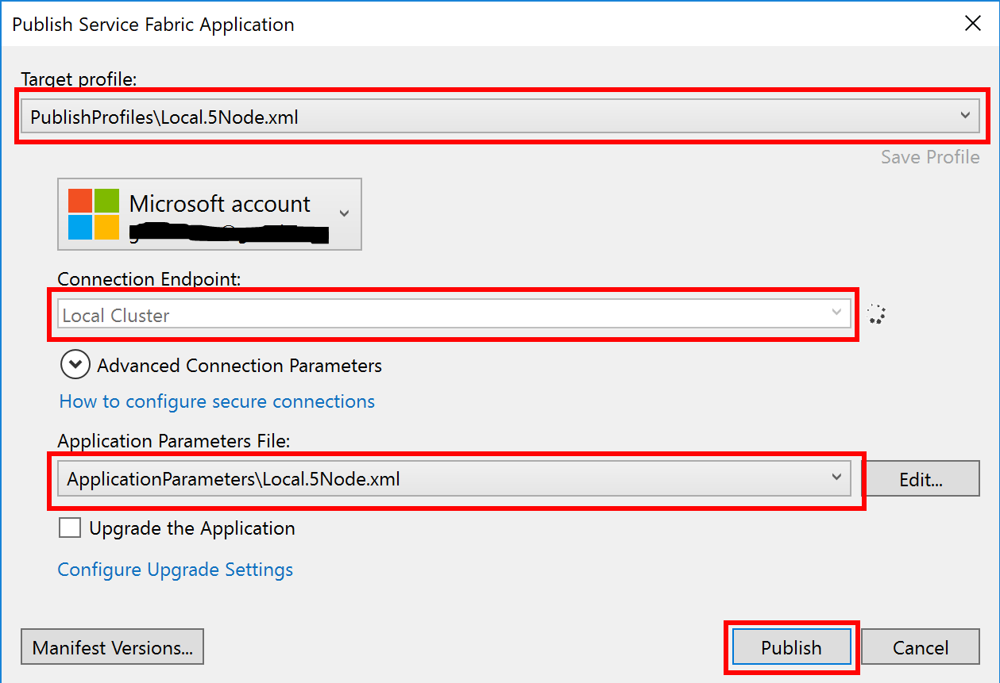

30. Adjunta el debugger, seleccionando **Debug** y luego **Attach to process...**, lo que mostrará el cuadro de diálogo para adjuntar un proceso.
31. Asegúrate de tener marcado **Show processes from all users**.
32. En la lista de procesos, elije *VotingService.exe* y haz clic en **Attach**.

    

33. Agrega algunos items para votar, y vota por ellos. Mientras los haces verás aparecer los eventos en la ventana de Diagnostic Events. Si no aparecen eventos, cierra y reabre la ventana, y asegúrate que el filtro tenga el nombre de origen de evento que está listado al comiendo de _ServiceEventSource.cs_.

    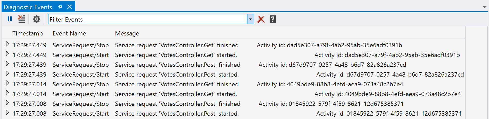

    y mirando SFX, selecciona la instancia y luego haz clic sobre **DETAILS** en la vista de instancia y verás el reporte de carga y el reporte de salud. Visita nuevamente la pantalla luego de hacer requests y verás como se incrementan los valores.

    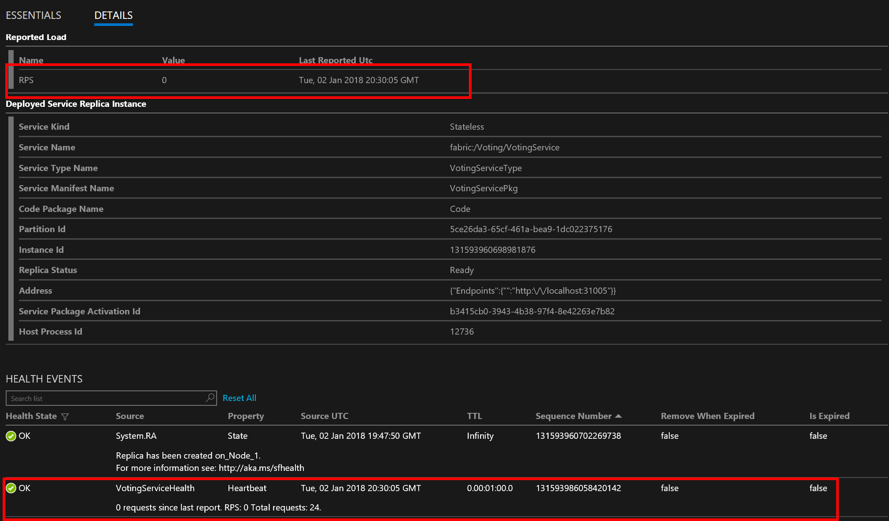

34. **Pon un breakpoint en el método _ReportHealthAndLoad_ en VotingService.cs y déjala detenida en el breakpoint por unos minutos.** En SFX verás que la instancia se pone en estado de error porque el tiempo de vida del HealthReport ha expirado. Esto puede ayudar en la detección de problemas con el código de reporte de salud del servicio.

    

35. **Remover el breakpoint y dejar que el código siga corriendo** y luego de ~30 segundos el servicio indicará nuevamente que todo se encuentra saludable. Este es un reporte de salud simple; se puede hacer mucho más con el modelo de reporte de salud incorporado.
36. Cuando hayas terminado de usar la aplicación, sal de la sesión de debugging seleccionando **Debug** y luego **Detach all**. Esto hará que la aplicación se siga ejecutando. Necesitamos hacer esto porque lo próximo que haremos será actualizar el servicio que está corriendo. Si quieres validar que la aplicación todavía está corriendo, puedes verificar que SFX todavía tenga la aplicación desplegada y el sitio todavía estará operando.

## Configuración y upgrade
Esta sección demostrará como usar la configuración de Service Fabric y como ejecutar un upgrade de la aplicación sin downtime. Desplegaremos nuevo código y nueva configuración y veremos como Service Fabric hace el upgrade de la aplicación en cada upgrade domain.

37. En Visual Studio, navegar al proyecto VitingService, la carpeta PackageRoot, luego la carpeta Config, y abre **Settings.xml**. Agrega lo siguiente dentro del elemento _Settings_:

    ```xml
    <Section Name="Health">
        <Parameter Name="HealthCheckIntervalSeconds" Value="40" />
    </Section>
    ```

38. Abre _VotingService.cs_. En el método _ReportHealthAndLoad_ agrega la siguiente línea de código al final del método. Esto enviará un reporte al stream de eventos de diagnóstico adicionalmente al sistema de salud, permitiendo el tracking de valores históricos de salud.

    ```csharp
    // Log the health report.
    ServiceEventSource.Current.HealthReport(hi.SourceId, hi.Property, Enum.GetName(typeof(HealthState), hi.HealthState), Contex`.PartitionId, Context.ReplicaOrInstanceId, hi.Description);
    ```

39. Asegúrate que **System.Fabric.Description** esté dentro de los usings en _VotingService.cs_.
40. Pegar el siguiente código al final de la clase **VotingService**

    ```csharp
    private void CodePackageActivationContext_ConfigurationPackageModifiedEvent(object sender, PackageModifiedEventArgs<ConfigurationPackage> e)
    {
        ServiceEventSource.Current.Message("CodePackageActivationContext_ConfigurationPackageModifiedEvent");
        LoadConfiguration();
    }

    private void LoadConfiguration()
    {
        ServiceEventSource.Current.Message("LoadConfiguration");

        // Get the Health Check Interval configuration value.
        ConfigurationPackage pkg = Context.CodePackageActivationContext.GetConfigurationPackageObject("Config");
        if (null != pkg)
        {
            if (true == pkg.Settings?.Sections?.Contains("Health"))
            {
                ConfigurationSection settings = pkg.Settings.Sections["Health"];
                if (true == settings?.Parameters.Contains("HealthCheckIntervalSeconds"))
                {
                    int value = 0;
                    ConfigurationProperty prop = settings.Parameters["HealthCheckIntervalSeconds"];
                    if (int.TryParse(prop?.Value, out value))
                    {
                        _interval = TimeSpan.FromSeconds(Math.Max(30, value));
                        _healthTimer.Change(_interval, _interval);
                    }

                    ServiceEventSource.Current.HealthReportIntervalChanged("VotingServiceHealth", "IntervalChanged", Context.PartitionId, Context.ReplicaOrInstanceId, (int) _interval.TotalSeconds);
                }
            }
        }
    }
    ```

41. En el **constructor de VotingService**, agrega lo siguiente

    ```csharp
    context.CodePackageActivationContext.ConfigurationPackageModifiedEvent += CodePackageActivationContext_ConfigurationPackageModifiedEvent;
    ```

42. En **OpenAsync, reemplaza el cuerpo del método** con lo siguiente

    ```csharp
    // Force a call to LoadConfiguration because we missed the first event callback.LoadConfiguration();

    _client = new FabricClient();
    _healthTimer = new Timer(ReportHealthAndLoad, null, _interval, _interval);
    return base.OnOpenAsync(cancellationToken);
    ```

43. En _VotesController.cs_ actualiza el número de versión del método **GetFile**, actualiza la línea con el path del archivo. Cambia el número de versión de 1.0.0 a 1.0.1. Esta es la misma versión a la que actualizaremos el código en el paso 45.
44. Haz clic derecho sobre el proyecto Voting y selecciona **Publish...**, aparecerá el diálogo de Publish Service Fabric Application. Selecciona **PublishProfiles\Local.5Node.xml** como Target profile, que seleccionará Local cluster para el Connection Endpoint y **Local.5Node.xml** para Application Parameters File. Asegúrate de que esté seleccionado **Upgrade the Application**.

    

45. Haz clic en el botón **Manifest versions...**, se desplegará el diálogo Edit versions. Expande VotingServicePkg. Luego cambia el valor de la columna New Version a 1.0.1 para **VotingType**, **VotingServicePkg**, **Code** y **Config**. Haz clic en **Save** para cerrar el diálogo. Esto actualiza el número de versión para el paquete de código, el servicio y aplicación en _ApplicationManifest.xml_ y _ServiceManifest.xml_.

    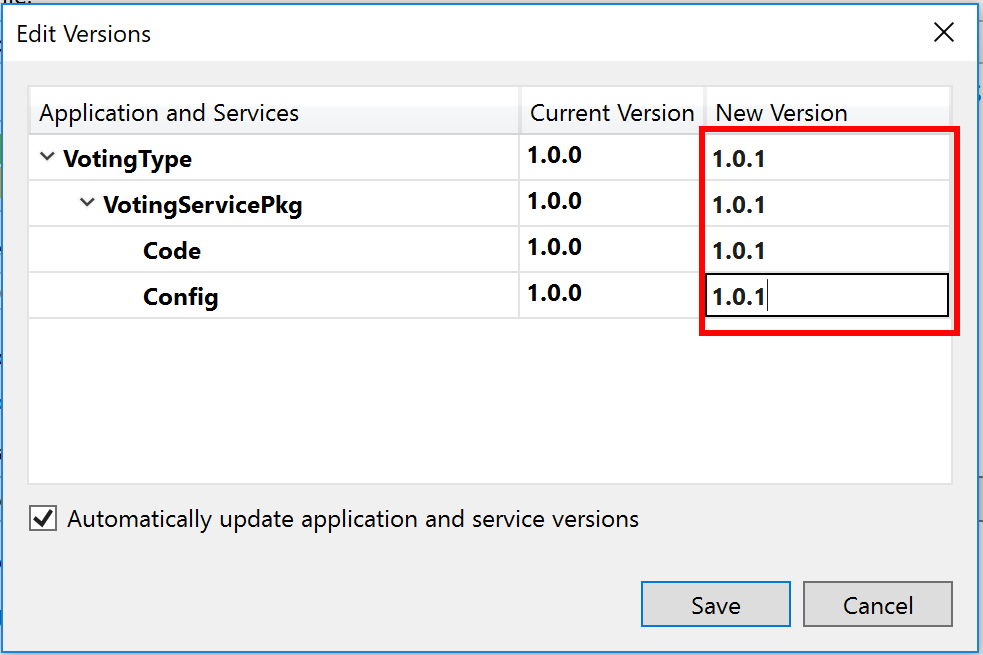

46. Asegúrate que los valores son correctos y haz clic en **Publish**, lo cual comenzará a actualizar la aplicación en tu cluster local. Puedes observar el progreso en SFX eligiendo la aplicación fabric:/Voting en el panel de navegación.

    

    Esta página muestra el progreso mientras cada upgrade domain es actualizado y muestra los números de versión original y actualizado.

47. Asegúrate que el browser esté apuntando al endpoint correcto ya que la instancia puede haberse movido de nodo durante la actualización. Notarás que todos los datos que habías ingresado hasta ahora se han perdido. Esto sucede porque durante una actualización de código cada una de las instancias de servicio siendo actualizada es reiniciada, y como es un servicio stateless al ser reiniciado pierde toda la información que tenía en cache - resolveremos esto en la Parte II del lab. También, durante la actualización, el servicio no estuvo disponible, porque estaba desplegada sólo una instancia. Para resolver esto desplegaremos múltiples instancias del servicio. Si miras la ventana de Diagnostic events (la abres yendo a View | Other Windows | Diagnostic Events), verás que el intervalo del reporte de salud es de 40 segundos.
48. Queremos más de una VM hosteando esta aplicación, así que a continuación vamos a desplegar más instancias del servicio en nodos adicionales. Visual Studio usa lo que se llama Default Services definidos en ApplicationManifest.xml para desplegar servicios. Hay una limitación por la cual no se puede cambiar la configuración de una aplicación default, por lo que usaremos el comando de Windows PowerShell **Update-ServiceFabricService** para actualizar el número de instancias. Abre **Windows PowerShell** y escribe

    1. `Connect-ServiceFabricCluster` y presiona Enter. Deberías ver en la salida que estás conectado al cluster.
    2. `Update-ServiceFabricService -ServiceName fabric:/Voting/VotingService -Stateless -InstanceCount 3 -Force` y presiona Enter. Deberías ver un mensaje diciendo "Update service succeeded", y si miras en SFX verás 3 instancias en la página, y que Instance count ha cambiado a 3.

    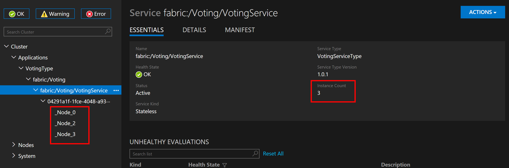

    Ahora hay 3 instancias del servicio stateless corriendo, cada una con una cache independiente de votos. Si navegas a una de ellas e ingresas datos, luego navegas a otra, los datos por supuesto no se verán reflejados. Como mencionamos anteriormente, esto será solucionado como parte del próximo lab. El beneficio de tener múltiples instancias corriendo es el poder tener una o más instancias caídas y sin embargo poder seguir aceptando peticiones de nuestros clientes.

49. Abre **Settings.xml** y cambia el valor de **HealthIntervalSeconds** a 60. Ahora desplegaremos este cambio en la configuración. Esto hará un despliegue de la configuración solamente. El método _LoadConfiguration_ será llamado y el intervalo del timer de salud cambiará a 60 segundos sin reiniciar el código! Puedes ver esto mirando el evento _HealthReportIntervalChanged_ en el visor de diagnóstico.
50. Haz clic derecho sobre el proyecto Voting y selecciona **Publish...**, aparecerá el diálogo de Publish Service Fabric Application. Asegúrate que **PublishProfiles\Local.5Node.xml** está seleccionado como Target Profile y que **Upgrade the Application** está seleccionado.
51. Haz clic en el botón **Manifest Versions...**, se desplegará el diálogo de Edit Versions. Cambia el valor de la columna New Version a 1.0.2 para **VotingType**, **VotingServicePkg** y **Config**. Haz clic en **Save** para cerrar el diálogo.

    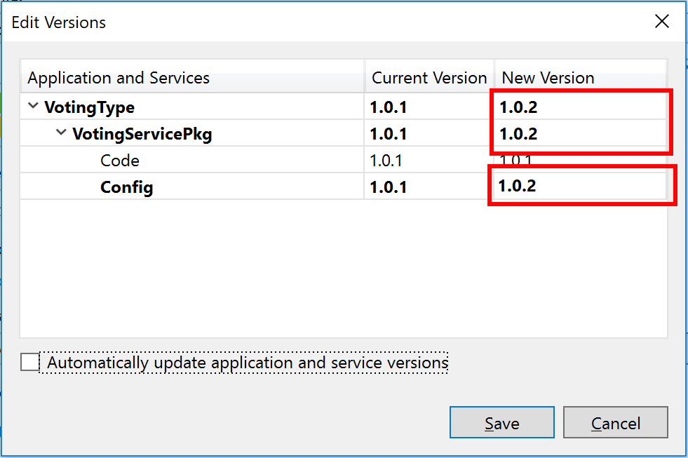

52. En SFX, selecciona la aplicación fabric:/Voting en el panel de navegación. Esto te permitirá ver la actualización, la cual debería ser muy rápida, porque es sólo configuración y no requiere reiniciar los servicios.
53. Haz clic en **Publish** en el diálogo de Publish Service Fabric Application cuando estés listo. En la vista de diagnóstico, verás tres grupos de los mismos eventos, porque el despliegue no está sucediendo sobre las tres instancias. Primero verás un mensaje sobre el paquete de código que está siendo llamado, luego verás un mensaje que el método LoadConfiguration fue llamado, y finalmente verás el que un mensaje del evento HealthReportIntervalChanged indicando que el intervalo de salud ha sido cambiado a 60 segundos.

    

## Actualización y rollback

Esta sección mostrará cómo usar la configuración de Service Fabric y realizar una actualización sin downtime de la aplicación, pero esta vez chequeando la salud de la aplicación y haciendo un rollback si no cumple con la política de salud. Hasta ahora, todas las actualizaciones han sido actualizaciones 'UnmonitoredAuto', en donde Service Fabric automatiza la actualización pero saltea el chequeo de salud. Ahora pasaremos a una actualización 'Monitored' que también automatiza la actualización, pero incluye chequeos de salud.

54. En _VotingService.cs_ agregaremos chequeos de salud con fallas para demostrar el rollback. Agrega lo siguiente **al final** del método **ReportHealthAndLoad**

    ```csharp
    // Report failing health report to cause rollback.
    var nodeList = _client.QueryManager.GetNodeListAsync(Context.NodeContext.NodeName).GetAwaiter().GetResult();
    var node = nodeList[0];
    if ("4" == node.UpgradeDomain || "3" == node.UpgradeDomain || "2" == node.UpgradeDomain)
    {
        hi = new HealthInformation("VotingServiceHealth", "Error_Heartbeat", HealthState.Error);
        hi.TimeToLive = _interval.Add(_interval);
        hi.Description = $"Bogus health error to force rollback.";
        hi.RemoveWhenExpired = true;
        hi.SequenceNumber = HealthInformation.AutoSequenceNumber;
        sshr = new StatelessServiceInstanceHealthReport(Context.PartitionId, Context.InstanceId, hi);
        _client.HealthManager.ReportHealth(sshr);
    }
    ```

55. En Visual Studio, haz clic en **Publish...** en el proyecto Voting, lo cual mostrará el diálogo Publish Service Fabric Application. Haz clic en la opción **Configure Upgrade Settings** para abrir el diálogo Edit Upgrade Settings. Selecciona **Monitored** para **Upgrade mode**, lo cual nos dará un número de opciones. Pon 120 en el valor para **HealthCheckRetryTimeoutSec** y 60 para **HealthCheckStableDuractionSec**, luego haz clic en **OK**.

    > Nota: Esta configuración no es apropiada para uso general - se usa aquí sólo para hacer más corto el lab.

    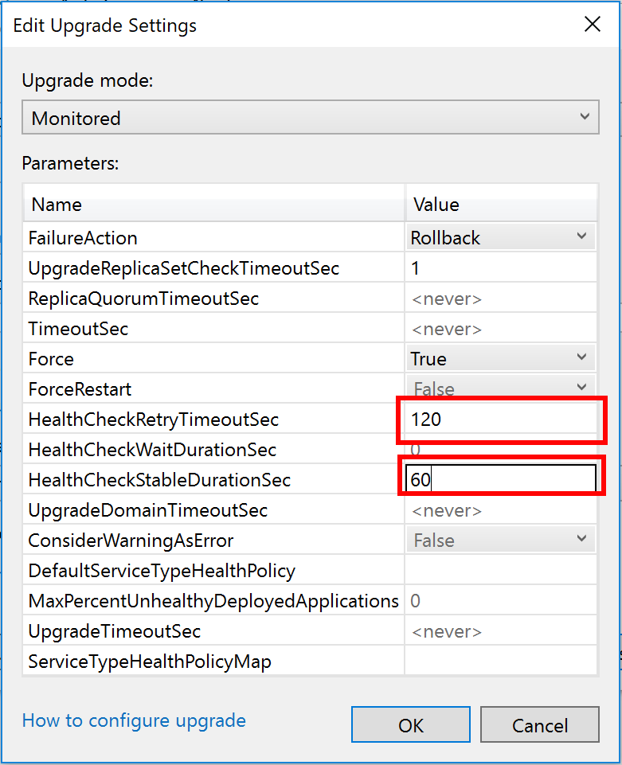

56. Haz clic en el botón **Manifest versions...**, se abrirá el diálogo Edit Versions. Expande VotingServicePkg. Luego cambia el valor de la columna New Version a 1.0.3 para **VotingType**, **VotingServicePkg** y **Code**. Haz clic en **Save** para cerrar el diálogo. Esto actualiza los números de versión para el paquete de código, el servicio y la aplicación en _ApplicationManifest.xml_ y _ServiceManifest.xml_.

    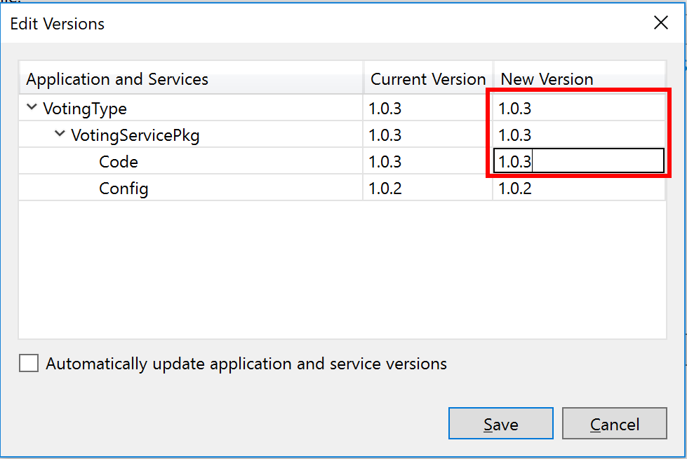

57. Asegúrate que **Upgrade the Application** esté seleccionado en el diálogo Publish Service Fabric Application, luego haz clic en **Publish**. Selecciona la aplicación Voting en SFX para ver el progreso. El progreso de las cosas dependerá de los nodos en los cuales las 3 instancias estén desplegadas. Tres es importante en esta demostración porque el código que agregamos sólo correrá correctamente en los primeros dos Upgrade Domains (UD). En UD2, UD3 y UD4 se generará un error de salud. En el ejemplo de abajo, las instancias están desplegadas en 1, 3 y 4. UD0, UD1 y UD2 desplegaron sin error, pero UD3 está como unhealthy después que se ejecutó el chequeo de salud, como se muestra en la figura abajo

    

    Luego que hayan expirado todos los timeouts, lo cual sucederá después de unos minutos dada la configuración con una duración reducida, se ejecuta un rollback a la versión anterior automáticamente como se ve en la figura siguiente

    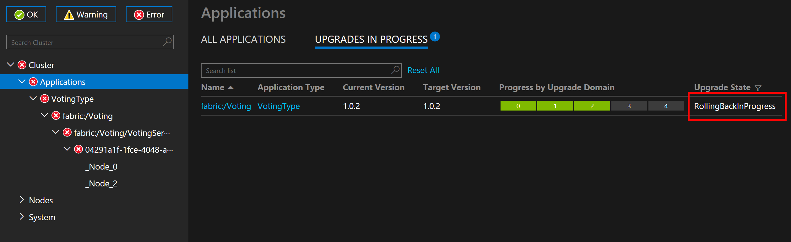

    Luego de ejecutar el rollback, la versión previa, 1.0.2, está corriendo en todos los UDs.

    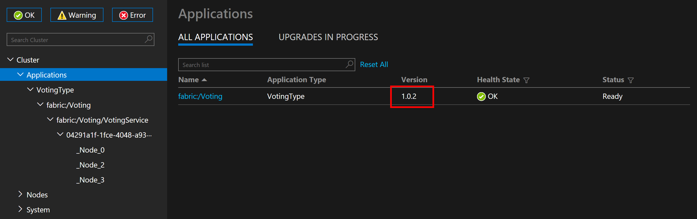

Has aprendido cómo crear un servicio stateless, cómo enviar logs a ETW, a hacer chequeos de salud, usar la configuración y hacer despliegues. En la [Parte II](../Lab2/README.md) del lab solucionaremos el problema en el cual cada servicio stateless tiene su propia versión de los datos creando un servicio stateful que contenga los datos de los votos. También aprenderás el patrón stateless gateway y restricciones de ubicación. 

<!-- En la [Parte III](../Lab3/README.md) pasaremos de nuestro nodo de desarrollo a hacer un despliegue en Azure. -->